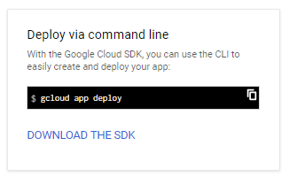
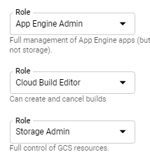
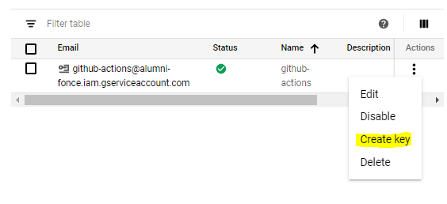
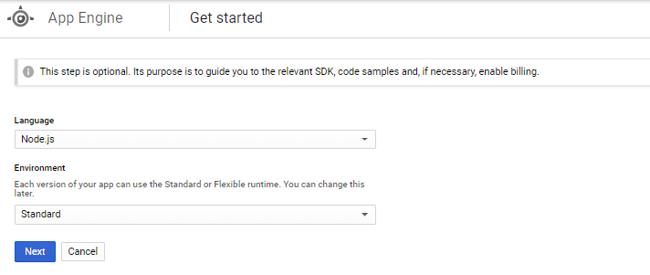
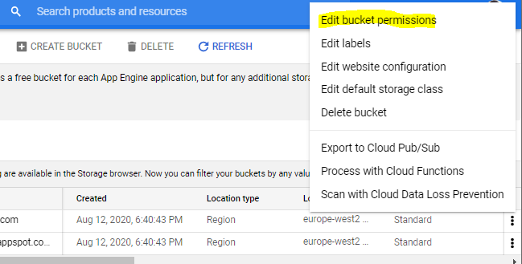
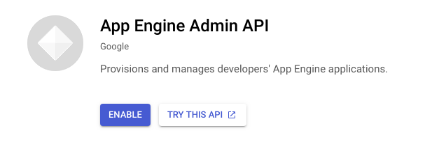
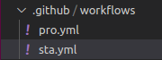
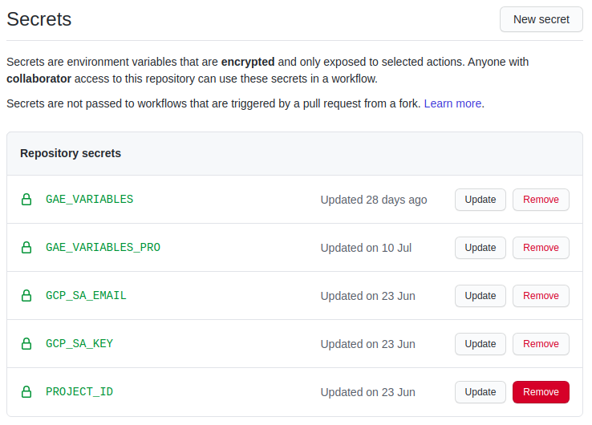

# Deployments

You can deploy Edge on Vercel by just adding the environment variables needed, but you will need a paid plan. 

In this document we explain how to deploy this solution on Google Cloud Platform. 

## Environment Variables


To deploy your site with all the functionalities you need to follow the next steps:

1. Create accounts for all the environment variables needed
2. Configure the environment variables in Vercel dashboard (or your service of choice)
3. Done


All the environment variables you need to configure are defined inside the `.env.build`  file

```
AUTH_TOKEN_SECRET=secret-token-to-generate-sessions

BASE_URL=http://localhost:3000

MONGODB_URI=MONGODB_URI=mongodb+srv://<username>:<password>@<url>
MONGODB_DATABASE=<database>

SENDGRID_KEY=XXX

GOOGLE_CLIENT_EMAIL=XX
GOOGLE_PRIVATE_KEY=XX
GOOGLE_PROJECTID=XX
GOOGLE_BUCKET_NAME=edge-next

FACEBOOK_ID=XX
FACEBOOK_SECRET=XX
GITHUB_ID=XX
GITHUB_SECRET=XX
GOOGLE_ID=XX
GOOGLE_SECRET=XX

NEXT_PUBLIC_GMAPS_API_KEY=XXXX

NEXT_PUBLIC_GA_TRACKING_ID=xx
```

- **Base url**: Used to redirect oauth enpoints. Set `BASE_URL` to the url of your deployment
- **Google Analytics**: Set `NEXT_PUBLIC_GA_TRACKING_ID` to the Tracking Id from Google Analytics
- **Social Providers**: Set `FACEBOOK_ID`, `FACEBOOK_SECRET`, `GOOGLE_ID`, `GOOGLE_SECRET`, and `GITHUB_ID`, `GITHUB_SECRET`
- **Storage**: For google cloud storage configure `GOOGLE_CLIENT_EMAIL`, `GOOGLE_PRIVATE_KEY`, `GOOGLE_PROJECTID` and `GOOGLE_BUCKET_NAME` from your credentials file.
- **Email**: Configure `SENDGRID_KEY`
- **Google Maps**: Configure `NEXT_PUBLIC_GMAPS_API_KEY`


## Deploying on Vercel

Deploy Edge using [Vercel](https://vercel.com):


If you want your deployment in Vercel to recognize the `ENVIRONMENT` values, you will need to add the secrets to your deployment. 

You can add them through the command line or through the administration dashboard in Vercel.com


----

# NextJS + GAE CICD

## INTRO

**Google App Engine** allows you to create scalable applications hosted in a serverless platform. To send orders to the GAE platform from the command line, you have available the Google Cloud SDK:



With the SDK installed, you could go to the root folder of your project **and** run **gcloud app deploy** in order to deploy your app to GAE platform. 

Thanks to Github Actions, instead of running this command in your local machine, we can run it in Github hosted machine (runner) whenever a specific event occurs in our repository.

This is a sketch of the interaction between the two:

[](./images/diagram.png)

**WITH THIS SETUP**

- **A COMMIT IN MASTER BRANCH WILL DEPLOY THE PRODUCTION VERSION (service default)**
- **A NEW TAG WILL DEPLOY THE STAGING VERSION (service sta)**

## SETUP GOOGLE CLOUD

### Create and configure a service account

Visit [https://console.cloud.google.com/iam-admin/serviceaccounts/create](https://console.cloud.google.com/iam-admin/serviceaccounts/create)

I Create a new Service Account

II Grant the following roles:

- App Engine Admin
- Storage Admin
- Cloud Build Editor
- 



III Generate key (JSON)



Generate a JSON file with the key for this service account. **YOU WILL NEED THIS FILE TO STORE THE VALUES AS GITHUB SECRETS.**

**Create an application in App Engine**

Visit [https://console.cloud.google.com/appengine](https://console.cloud.google.com/appengine) and create an application.



### Configure Storage buckets

Visit [https://console.cloud.google.com/storage/browser](https://console.cloud.google.com/storage/browser)



I Edit bucket permissions and add your service account as a member of these buckets:

- staging.PROJECT-ID.appspot.com
- REGION.artifacts.PROJECT-ID.appspot.com (Create bucket with this name, if you don’t have one)

with the roles **Storage Object Creator** and **Storage Object Viewer**.

### Enable APIs

- Go to [https://console.cloud.google.com/](https://console.cloud.google.com/) and search “App Engine Admin API”. Hit “ENABLE” button and the API will be enabled in a few seconds.



- Search “Cloud Resource Manager API” and enable this API too.
- Search "Cloud Build API" and enable this API too.

### Enable Billing

## SETUP GITHUB ACTIONS AND SECRETS

Github Actions reads the workflows for your application from **project_folder/.github/workflows**. Each workflow defines which events trigger its execution.



We will define two workflows to be executed by the Github runners:
1- **Production** (on push a new tag)

```jsx
on:
  push:
    tags:
      - v*
```

2- **Staging** (on push commit to master)

```jsx
on:
  push:
    branches:
      - master
```

### Github Actions

Now, let’s see how to invoke the **gcloud app deploy** command from within Github Actions. I will go through all the steps of the yaml file, you can find the link to the example repo **here**. (TODO)

These will be the steps:

```jsx
- name: Checkout
        uses: actions/checkout@v1
```

We checkout the current contents of the repo.

```jsx
- name: Setup node
        uses: actions/setup-node@v1
        with:
          node-version: 12.x
      - run: node generate-vars.js "${{ secrets.GAE_VARIABLES }}"
```

We download/cache the node version 12.x. Then, we execute the generate-vars.js script, passing the GAE_VARIABLES secret as argument (this secret comes from the CICD).

```jsx
- name: Initialize Google Cloud SDK
        uses: zxyle/publish-gae-action@master
        with:
          gae_config_path: './app-sta.yaml'
          service_account_email: ${{ secrets.GCP_SA_EMAIL }}
          service_account_key: ${{ secrets.GCP_SA_KEY }}
          project_id: ${{ secrets.PROJECT_ID }}
          gae_variables: ${{ secrets.GAE_VARIABLES }}
```

We use a pre built step with Google Cloud SDK with following configuration variables:

**gae_config_path**: path to the repo’s yaml for GAE ([https://cloud.google.com/appengine/docs/standard/python/config/appref](https://cloud.google.com/appengine/docs/standard/python/config/appref))

**service_account_email**, **service_account_key**, **project_id**: Google Cloud project data

**gae_variables**: variables to be passed to the app build

```jsx
- name: Publish app to Google App Engine
        run: |
          # This client-secret.json is converted by GCP_SA_KEY.
          gcloud auth activate-service-account ${{ secrets.GCP_SA_EMAIL }} --key-file=client-secret.json
          gcloud config set project ${{ secrets.PROJECT_ID }}
          gcloud app deploy app-sta.yaml -q --promote --stop-previous-version
```

We use Google Cloud SDK commands to authenticate with the service account and deploy the application to GAE

### Github Secrets

We have two types of secrets: 

- secrets with values needed for deploying in GAE (GCP_SA_MAIL, GCP_SA_KEY and PROJECT_ID). **THEY COME FROM THE JSON FILE GENERATED WHEN YOU CREATE THE SERVICE ACCOUNT.**
- secrets with values consumed in the app's code (GAE_VARIABLES and GAE_VARIABLES_PRO).



GCP_SA_EMAIL (service account’s email)

GCP_SA_KEY (service account’s key json file, encoded as base64 string **$cat project-id.json | base64**)

PROJECT_ID (project’s id google cloud platform)

GAE_VARIABLES/GAE_VARIABLES_PRO: This is an encoded version of the environment variables that are used inside the application. To generate the encoded value, follow this steps:

- Create a JSON file like this

```jsx
{
  "env_variables": {
    "NEXT_PUBLIC_GOOGLE_MAPS_API_KEY": "xxx-xxx",
  }
}
```

- Encode the file contents

`base64 -i myvariables.json`

- Store the result in the Github secret.

To update the environment variables, you can repeat this process and store the value in the same Github secret.

## CHANGES IN THE NEXTJS REPOSITORY

### New commands in package.json (2)

```jsx
*"gcp-build"*: *"next build"*,
*"deploy"*: *"gcloud app deploy"*
```

**NOTE: YOUR APP SHOULD LISTEN TO REQUESTS ON PORT 8080:**

`"start": "next start -p 8080",`

### New files to add (6)

**project/generate-vars.js**

```jsx
fs = require('fs')
 
const myArgs = process.argv.slice(2)
const buf = Buffer.from(myArgs[0], 'base64')
const vars = JSON.parse(buf.toString()).env_variables
 
Object.keys(vars).forEach(function (key) {
  const data = key + '="' + vars[key] + '"\n'
  fs.appendFileSync('.env.local', data)
})
```

**project/app-pro.yaml**

```jsx
runtime: nodejs12
instance_class: F2

service: default
```

**project/app-sta.yaml**

```jsx
runtime: nodejs12
instance_class: F2

service: sta
```

The Node.js runtime is the software stack responsible for installing your application's code (**npm install**) and its dependencies and running your application (**npm start**).

- Read more on NodeJS runtime environment here: [https://cloud.google.com/appengine/docs/standard/nodejs/runtime](https://cloud.google.com/appengine/docs/standard/nodejs/runtime)
- Read more on instance class:
[https://cloud.google.com/appengine/docs/standard#instance_classes](https://cloud.google.com/appengine/docs/standard#instance_classes)
- Read more on services : 
[https://cloud.google.com/appengine/docs/standard/python/an-overview-of-app-engine](https://cloud.google.com/appengine/docs/standard/python/an-overview-of-app-engine)

**NOTE: THE FIRST SERVICE DEPLOYED MUST BE "default"**

**project/.gcloudignore**

```jsx
.gcloudignore

.git

.gitignore

node_modules
```

**project/.gihub/workflows/pro.yml**

```jsx
name: PROJECT NAME - PRO
 
on:
  push:
    tags:
      - v*
jobs:
  deploy:
    runs-on: ubuntu-latest
 
    steps:
      - name: Checkout
        uses: actions/checkout@v1
      - name: Setup node
        uses: actions/setup-node@v1
        with:
          node-version: 12.x
      - name: Generate environment variables file
        run: node generate-vars.js "${{ secrets.GAE_VARIABLES_PRO }}"
      - name: Initialize Google Cloud SDK
        uses: zxyle/publish-gae-action@master
        with:
          gae_config_path: './app-pro.yaml'
          service_account_email: ${{ secrets.GCP_SA_EMAIL }}
          service_account_key: ${{ secrets.GCP_SA_KEY }}
          project_id: ${{ secrets.PROJECT_ID }}
          gae_variables: ${{ secrets.GAE_VARIABLES_PRO }}
 
      - name: Publish app to Google App Engine
        run: |
          # This client-secret.json is converted by GCP_SA_KEY.
          gcloud auth activate-service-account ${{ secrets.GCP_SA_EMAIL }} --key-file=client-secret.json
          gcloud config set project ${{ secrets.PROJECT_ID }}
          gcloud app deploy app-pro.yaml -q
```

**project/.gihub/workflows/sta.yml**

```jsx
name: PROJECT NAME - STA
 
on:
  push:
    branches:
      - master
 
jobs:
  deploy:
    runs-on: ubuntu-latest
 
    steps:
      - name: Checkout
        uses: actions/checkout@v1
      - name: Setup node
        uses: actions/setup-node@v1
        with:
          node-version: 12.x
      - name: Generate environment variables file
        run: node generate-vars.js "${{ secrets.GAE_VARIABLES }}"
      - name: Initialize Google Cloud SDK
        uses: zxyle/publish-gae-action@master
        with:
          gae_config_path: './app-sta.yaml'
          service_account_email: ${{ secrets.GCP_SA_EMAIL }}
          service_account_key: ${{ secrets.GCP_SA_KEY }}
          project_id: ${{ secrets.PROJECT_ID }}
          gae_variables: ${{ secrets.GAE_VARIABLES }}
      - name: Publish app to Google App Engine
        run: |
          # This client-secret.json is converted by GCP_SA_KEY.
          gcloud auth activate-service-account ${{ secrets.GCP_SA_EMAIL }} --key-file=client-secret.json
          gcloud config set project ${{ secrets.PROJECT_ID }}
          gcloud app deploy app-sta.yaml -q --promote --stop-previous-version
```

If you have configured your Google Cloud account and Github secrets correctly, the commit of these files to your master branch should deploy a a new service called **sta**.

[]()